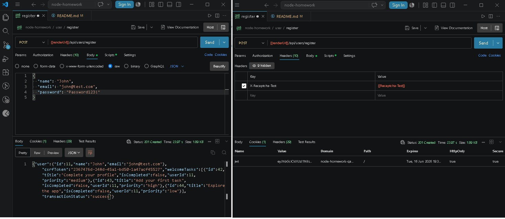
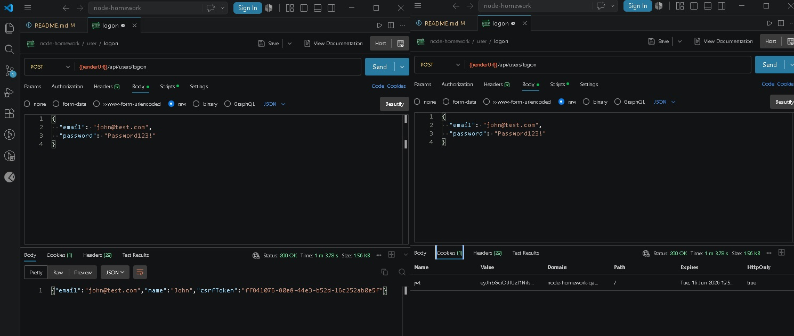
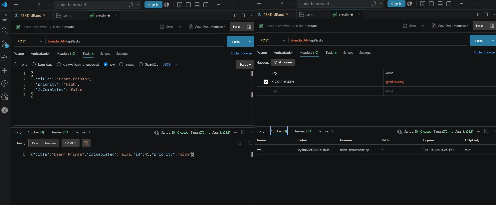
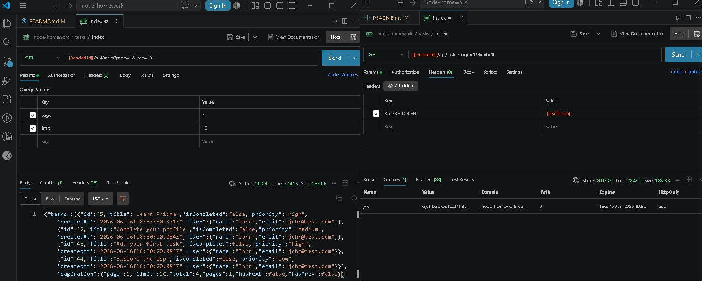

# Node Homework – Task Management API

This is a full-featured REST API built with Node.js, Express, PostgreSQL, and Prisma ORM.

It includes authentication, task management, analytics, Google OAuth, and secure production-ready architecture.

# Base URL (Production API)

 https://node-homework-qa6u.onrender.com

# Deployment

Backend: Render
Database: Neon PostgreSQL

# Features

## Authentication

* Register user (email/password)
* Secure password hashing (scrypt)
* JWT authentication (HTTP-only cookies)
* CSRF protection
* Google OAuth login
* Logout system

## Task Management

* Create / update / delete tasks
* Bulk task creation
* Ownership-based access control

## Advanced Query Features

* Search tasks by title or username
* Filters: completion, priority, date range
* Sorting: title, priority, createdAt, id, isCompleted
* Pagination with metadata (total, pages, hasNext, hasPrev)

## Analytics

* User task statistics (completed / not completed)
* Recent tasks (last 10)
* Weekly activity tracking
* Users list with pagination
* Task count per user

## Security

* JWT in HTTP-only cookies
* CSRF protection
* Helmet security headers
* Rate limiting (100 requests / 15 min)
* XSS protection
* Prisma ownership checks
* Graceful shutdown handling

## Tech Stack

* Backend: 

Node.js
Express.js

* Database:

PostgreSQL
Prisma ORM
Neon

* Authentication & Security:

JWT
Google OAuth
HTTP-only Cookies
Helmet
Express Rate Limit

* Testing:

Jest
Supertest

# API Endpoints

* Users

 POST    /api/users/register     Register user      
 POST    /api/users/logon        Login user         
 POST    /api/users/googleLogon  Google OAuth login 
 GET     /api/users/:id          Get user profile   
 POST    /api/users/logoff       Logout user        

* Tasks

 GET     /api/tasks       Get tasks (filter, sort, pagination) 
 POST    /api/tasks       Create task                          
 POST    /api/tasks/bulk  Bulk create tasks                    
 GET     /api/tasks/:id   Get task                             
 PATCH   /api/tasks/:id   Update task                          
 DELETE  /api/tasks/:id   Delete task                          

* Analytics

 GET     /api/analytics/users/:id     User analytics   
 GET     /api/analytics/users         Users with stats 
 GET     /api/analytics/tasks/search  Search tasks     

# API Usage Examples

## Register

http: POST /api/users/register

json: 
{
  "name": "John",
  "email": "john@test.com",
  "password": "Password123!"
}

## Login

 http: POST /api/users/logon

json: 
{
  "email": "john@test.com",
  "password": "Password123!"
}

## Create Task

http: POST /api/tasks

json:
{
  "title": "Learn Prisma",
  "priority": "high",
  "isCompleted": false
}

##  Get Tasks & Pagination

http: GET /api/tasks?page=1&limit=10

# Installation

bash: 
git clone https://github.com/OksanaMosendz/node-homework.git
cd node-homework
npm install

# Environment Variables

DATABASE_URL=
TEST_DATABASE_URL=
JWT_SECRET=
GOOGLE_CLIENT_ID=
GOOGLE_CLIENT_SECRET=
RECAPTCHA_SECRET=
RECAPTCHA_BYPASS=

# Database Setup

bash: 
npx prisma generate
npx prisma migrate dev

# Run Project

bash:
npm run dev
npm start

# Testing

bash:
npm test

#  Author

Code the Dream Student Project
GitHub: https://github.com/OksanaMosendz/node-homework